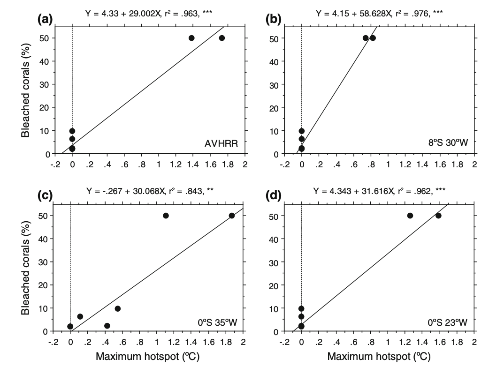

# Set Up

[Link to my GitHub
Repository](https://isaacmiller1113.github.io/ENVS-193DS_homework-03/code/ENVS-193DS_homework-03.html)

```{r}
#| label: set up chunk 
#| message: false

# Load in packages
library(tidyverse)     # general use
library(here)          # managing file paths relative to project root
library(janitor)       # cleaning data frames
library(readxl)        # importing data from excel files (.xls or .xlsx)
library(ggeffects)     # generating model predictions
library(gtsummary)     # generating summary tables for models
library(MuMIn)         # model selection and model inference
library(broom.helpers) # tidying and labeling model outputs

# Read in data objects
salinity <- read_csv(here("data", "salinity-pickleweed.csv")) |> 
  clean_names() |>  # Store salinity data
  rename(salinity_mscm = salinity_m_s_cm)

# read in my personal data and label it as an object called "my_data"
my_data <- read_csv(here("data", "my_data_hw3.csv")) |> 
  clean_names()

```

# Problem 1. Slough soil salinity

#### You are working at a restoration site where you are managing planting of California pickleweed (Salicornia virginica) along a brackish slough (i.e. there is a mixture of fresh water and salt water).

#### You decide to measure plant growth for individual pickleweed plants by plucking an individual out of the ground and measuring the biomass (in grams). You also measure soil salinity (as electrical conductivity in units of millisiemens per centimeter, or (mS/cm) at the location in which the individual was growing. Admittedly, this isn’t a perfect study, but it’s what you can do with the time and resources you have!

## a. An appropriate test

To determine the strength of the relationship between soil salinity
(mScm) and California pickleweed biomass (g), the two appropriate tests
are Pearson’s ($r$) correlation and Spearman’s ($\rho$) rank
correlation. Pearson's correlation is a parametric test that measures the
strength and direction of the relationship between variables (biomass
and salinity). Spearman's rank correlation is a non-parametric version, and unlike Spearman's, does not depend on the assumption that the data is normally
distributed or continuous. The test measures the monotonic relationship where the
data is ranked from smallest to largest and correlation is calculated
based on the ranked numbers rather than the actual measurements.

## b. Create a visualization

#### Create a visualization that would be appropriate for showing the relationship between soil salinity (in mS/cm) and California pickleweed biomass (in g).

```{r}
#| label: data visulaization

ggplot(data = salinity,
       aes(x = salinity_mscm,
           y = pickleweed)) +
  geom_point(color = "darkgreen",
            alpha = 0.6) + 
  labs(x = "Soil salinity (mS/cm)",
       y = "Pickleweed biomass (g)",
       title = "As Salinity Increases, Pickleweed Biomass also Increases") + 
  theme_bw()


```

## c. Check your assumptions and run your test

### 1. Check your assumptions

I can assume that these are all independent observations taken at separate locations. I can also assume that the there is a linear relationship between response and predictor variables based on the data visualization above, which has a general trend showing that a higher soil salinity corresponds to a higher picklweed biomass.

```{r}
#| label: create model object to fit linear model
# soil salinity (mScn) as a function of plant biomass (g)

salinity_model <- lm( # model object using linear model
  pickleweed ~ salinity_mscm, # formula (response ~ predictor)
  data = salinity # data frame 
)
```

```{r}
#| label: diagnostic plots

# base R residuals 
par(mfrow = c(2, 2)) # display plots in 2x2 grid
plot(salinity_model) # plotting residuals of model object 

```

The diagnostic plots show that the residualas have a constant variance
(homoscedastic) accross the range of fitted values according to the
Residuals vs Fitted and Scale-Location plots as they are evenly and
randomly distributed. The residuals (errors) seem to be normally
distributed according to the QQ Residuals plot as the data more or less
follows a straight line. According to the Residuals vs Leverage plot
there are no major outliers that might influence model estimates of
slope or y-intercept.

### 2. Run your test

```{r}
 
# more information about the model coefficients (slope and intercept)
summary(salinity_model)
```

For each one unit increase in salinity (mScm) there is an increase in biomass of 2.08 + 0.72 grams

```{r}
#| label: visualize model predictions

salinity_preds <- ggpredict( # create prediction object 
  salinity_model, # model object
  terms = "salinity_mscm")  # predictor variable 

# display the predictions
print(salinity_preds, n = Inf) 
```

```{r}
#| label: pearson's r correlation test

cor.test(salinity$pickleweed, salinity$salinity_mscm,
         method = "pearson")

```

I evaluated the assumptions for the Pearson's r correlation test, specifically for a linear relationship between soil salinity and pickleweed biomass variables, continuous variables, normally distributed data, and independent observations. I checked these assumptions by inspecting the original data visualization for a linear trend and to assess normality, confirming that both variables were measured on a continuous numeric scale, and ensuring the sampling design produced independent measurements. All of the assumptions are met, as my visual checks showed that the data is linear and normally distributed, the data is continuous, and the measurments are all independent. 

## d. Results communication

To evaluate the strength and direction of the relationship between soil salinity (mS/cm) and California pickleweed biomass (g), I used a Pearson’s ($r$) correlation test. This test was chosen because both variables are continuous, a visual inspection of the scatterplot confirmed a linear relationship without significant outliers, and the data is also normally distributed.

We found a moderate (Pearson's r = 0.53) relationship between soil salinity and California pickleweed biomass (g), indicating that as soil salinity increases, there is a corresponding increase in pickleweed biomass. (Pearson's r = 0.53, t(21) = 2.90, p > 0.001, $\alpha$ = 0.05) 

From our model coefficient estimates, we found that for each one unit increase in salinity (mScm) there is an increase in biomass of 2.08 ± 0.72 grams, which suggests that the growth of California pickleweed is positively associated with higher salt concentrations in the soil within the observed range. 

## e. Test implications

#### You’re working on a team of people at this restoration site who are also concerned about pickleweed planting. In 2-3 sentences, write what you would communicate to them about the results of this test and what it means for pickleweed planting success at your site.

Our data shows a moderate positive correlation between soil salinity and California pickleweed biomass, meaning that higher soil salt levels at our site actually promote more plant growth. Based on these results, we should prioritize restoration efforts in saltier patches to maximize planting success and biomass establishment. This allows us to use soil salinity as a key metric for identifying the most suitable locations for planting.

## f. Double check your own work.

```{r}
#| label: Spearman rank correlation

cor.test(salinity$pickleweed, salinity$salinity_mscm,
         method = "spearman")
```

Both the Pearson’s $r$ ($r = 0.53, p = 0.009$) and the Spearman’s $\rho$ ($\rho = 0.59, p = 0.003$) would have led to the same decision to reject the null hypothesis, as both p-values are well below the $\alpha$ = 0.05 threshold. While both tests confirm a significant positive relationship between soil salinity and pickleweed biomass, the Spearman’s test yields a slightly stronger correlation coefficient and a higher level of significance, but in general they represent the same relationship. This suggests that while the relationship is linear enough for Pearson’s, the monotonic (rank-order) relationship between salinity and biomass is even more consistent across the data set.

# Problem 2. Personal data

## a. Updating your visualizations

### Visualization 1. Physical activity on school vs. non-school days

```{r}
ggplot(my_data, # start with my data frame
       aes(x = `on_campus_class`, # x-axis is school day (yes/no) -> categorical predictor
           y = `total_physical_activity_min`, fill = `on_campus_class`)) + # y-axis is total physical activity -> response variable
  geom_boxplot(alpha = 0.6) + # make a boxplot, 
  geom_jitter(width = 0.2, # make a jitter
              size = 3, 
              alpha = 0.8, 
              shape = 21, 
              color = "black") +  
  labs( # change the text for x and y axis and the title
    x = "School Day", 
    y = "Total Physical Activity (minutes)",
    title = "Physical Activity Duration on School vs. Non-School Days",
    subtitle = "Most Recent Observation as of 03-04-2026"
  ) +
  scale_fill_manual(values = c("yes" = "#2E86AB", "no" = "#A23B72")) +  # Customize the colors
  theme_light() +  # Different theme from default
  theme(legend.position = "none")  # Remove legend since x-axis already shows the categories
```

### Visualization 2. Linear regression (new)

```{r}
#| label: cleaning data for new visulatization 
# creating a new object called data_clean from the my_datadata frame
data_clean <- my_data |> 
  # cleaning column names
  clean_names() |> 
  # calculate total school time (class + work)
  mutate(total_school_time = `time_spent_in_class_min` + `time_spent_on_work_min`) |> 
  # selected the comlumns of interest 
  select(total_school_time, total_physical_activity_min) |> 
  # renaming the activity time for clarity 
  rename(total_activity_time = total_physical_activity_min)

```

```{r}
#| label: Exploratory data visualization
# base layer: ggplot 
ggplot(data = data_clean, # starting with clean data frame
       aes(x = total_activity_time, # xaxis is acticity time (response)
           y = total_school_time)) + # yaxis is change in school time (predioctor)
  # first layer: points to represent individual days of activity 
  geom_point(size = 4, 
             stroke = 1,
             fill = "firebrick4",
             shape = 21)
```

```{r}
#| label: acitivity linear model
activity_model <- lm( # create the linear model object 
  total_activity_time ~ total_school_time, # formula: response variable ~ predictor variable
  data = data_clean      # data: clean_data frame 
)
```

```{r}
#| label: activity model diagnostics
par(mfrow = c(2, 2))   # displaying diagnostic plots in 2x2 grid
plot(activity_model)    # plotting diagnostics
```

```{r}
#| label: summary of model
# more information about the model
summary(activity_model)
```

```{r}
# creating a new object called activity_preds
activity_preds <- ggpredict(
  activity_model, # model object
  terms = "total_school_time"   # predictor (in quotation marks)
)

# display the predictions
print(activity_preds, n = Inf)
```

```{r}

# base layer: ggplot
# using clean data frame
ggplot(data = data_clean,
       aes(x = total_activity_time, # xaxis is acticity time (response)
           y = total_school_time)) + # yaxis is change in school time (predioctor)
  # first layer: points representing activities
  geom_point(size = 4,
             stroke = 1,
             fill = "firebrick4",
             shape = 21) +
  # second layer: ribbon representing confidence interval
  # using predictions data frame
  geom_ribbon(data = activity_preds,
              aes(x = x, # described by column x 
                  y = predicted,
                  ymin = conf.low, # lower bound 
                  ymax = conf.high), # upper bound
              alpha = 0.1) +
  # third layer: line representing model predictions
  # using predictions data frame
  geom_line(data = activity_preds,
            aes(x = x,
                y = predicted)) +
  # axis labels
  labs(x = "Total Activity Time (min)", 
       y = "Total School Time (min)",
       title = "Predicted Values of Activity Time vs School Time",
       subtitle = "Most Recent Observation as of 03-04-2026"
       ) +
  # better framing for the data
  coord_cartesian(xlim = c(0, 500), ylim = c(0, 400)) +
  # theme
  theme_minimal()
```

## b. Captions

**Figure 1: Comparison of Activity Duration by School Day Status.** This boxplot compares physical activity duration (minutes) between days with on-campus classes ("yes") and those without ("no"), where the teal and red boxes represent the interquartile range and the central horizontal line marks the median. Circular points represent individual days of activity in their respective categories with coresponding colors. The categorical predictor, School Day (x-axis), is plotted against the continuous response, Total Physical Activity (y-axis) in minutes, showing a clear divergence in habits. Non-school days maintain a substantially higher median (approx. 76.5 min) compared to school days (0 min). Statistically, the narrow distribution for on-campus days indicates that academic scheduling consistently restricts physical movement to a minimum, whereas non-school days means significant flexibility and peak activity duration.

**Figure 2: Linear Regression of School Time and Activity.** This scatterplot and linear regression visualize the trade off between academic commitment and physical movement over a 42-day period, with red colored circular points representing individual daily observations of total school time and corresponding total activity time. The analysis utilizes Total School Time (x-axis, in minutes) as the predictor and Total Activity Time (y-axis, in minutes) as the response, featuring a solid black trend line for predicted values and a grey shaded "ribbon" representing the 95% confidence interval. The model reveals a statistically significant negative relationship ($p = 0.009$), where the downward slope quantifies a decrease of approximately 0.23 minutes of activity for every one-minute increase in school time, confirming that high-volume academic days act as the primary constraint on physical exercise.

# Problem 3. Affective visualization

In this problem, you will create an affective visualization using your personal data in preparation for workshops during weeks 9 and 10.

In lecture, we talked about the three vertices of data visualization: 1) exploratory, 2) affective, and 3) communicative. We’ve done a lot of exploratory and communicative visualization, but have yet to think about affective visualization.

When thinking of affective visualization, you can expand your ideas of what data visualization could be. Some examples of affective visualizations include:

## a. Describe in words what an affective visualization could look like for your personal data (3-5 sentences).

An affective visualization of my personal data could be illustrated as a swamp landscape divided into land above the water and murky water below. The water represents the time I spend on schoolwork, with objects like assignments, books, and study materials submerged in the swamp. Above the water on dry land are objects that represent my physical activities, such as a surfboard, running shoe, skateboard, dumbbells, and snorkeling gear. An hourglass placed at the center of the scene represents the passage of time and how school responsibilities accumulate throughout my schedule. This visualization focuses on expressing the feeling of being “swamped” by schoolwork while still showing the activities I try to maintain outside of school.

## b. Create a sketch (on paper) of your idea.

[]

## c. Make a draft of your visualization.

[]

## d. Write an artist statement.

**Content**
This piece visualizes how my time is divided between school responsibilities and physical activities. The swamp water represents the time I spend on schoolwork, with objects like assignments, books, and study materials submerged beneath the surface. Above the water, items such as a surfboard, running shoe, skateboard, and gym weights represent the physical activities that exist outside of my academic responsibilities. The hourglass at the center represents the passage of time and how school demands can gradually fill and dominate my schedule.

**Influences**
My visualization was influenced by the concept of affective data visualization, which emphasizes communicating emotions and experiences through creative imagery rather than traditional charts. I was also inspired by illustrated environmental scenes and cross-section drawings that show what exists above and below the surface of landscapes. These influences helped me convey the feeling of being “swamped” by schoolwork.

**Form**
This work is a hand-drawn digital illustration created in a simple black-and-white line drawing style. The piece uses a cross-section view of a swamp landscape to visually separate school time below the water from physical activities on land.

**Process**
I began by placing the hourglass at the center of the composition to emphasize the passage of time and the accumulation of school commitments. I then added symbolic objects representing schoolwork and physical activities to reflect how my time is distributed. Along the way i sketched the overall swamp landscape and dividing the image into above water and underwater sections.

## e. Prep your materials to share in class

[Click here to view my Google Slides: The Swamp](https://docs.google.com/presentation/d/1Klz4RQpkrV2Ir5brsZGqftRX23nkccEKUgrjkcJ4VjM/edit?usp=sharing)


# Problem 4. Statistical critique

## a. Revisit and summarize

To address whether corals were affected by temperature anomalies, the authors used linear regression to examine the relationship between bleached coral colonies and HotSpot values from buoys and satellite data at the reef locations. In this analysis, the response variable was the average percentage of bleached coral, while the predictor variable was the warmer water temperatures (Hot Spot values). This test directly addresses the research question by determining if temperature anomalies are a statistically significant predictor of coral stress. A ‘significant’ result would show that temperature anomalies recorded by the buoys are a reliable
predictor of coral bleaching, meaning that higher Hot Spot values lead to higher percentages of
bleached corals. This would confirm that corals in the region are affected by temperature
anomalies and that buoy measurements can effectively track coral stress.

[]

## b. Visual clarity

The authors very clearly visually represented their statistics by overlaying linear regression models (Y = a + bX) directly onto the underlying scatter plot data for all 4 figures (each representing a different location or buoy). The x-axis correctly places the Maximum Hot spot (the predictor) while the y-axis shows the Bleached corals percentage (the response), creating a logical flow for interpreting the effect of heat stress on corals. The authors also included the equations of the regression lines, r^2^ values, and significance asterisks within the plot area which allows the reader to immediately understand the the model as well as its strength and reliability without searching through the text. By showing the raw data points alongside the trend line, the authors are transparent about the sample size and the variance of the coral response.

## c. Aesthetic clarity

The figure is has a very clean and minimalist design with a high data:ink ratio that avoids unnecessary grid lines and other visual clutter. The layout is calculated and sharp as the statistical annotations (r^2^, p-values, and regression equations) are placed in the empty white space above each panel, ensuring the text does not overlap with the data points. While the multi-panel layout is dense, the consistent use of simple black-and-white aesthetics and clear, evenly spaced axis labeling ensures that the primary focus remains on the trends in coral bleaching rather than being a distracting decoration.

## d. Recommendations

If I were the authors, I might add shaded 95% confidence intervals around each regression line to clearly illustrate the uncertainty of the model predictions across different temperature ranges. I think that it would also be visually appealing and possibly helpful for the reader if the authors used distinct colors or shapes for the data points to differentiate between the PIRATA buoy measurements and the satellite-derived Hot Spot values. The y-axis also shows the percentages only up to 50%. I would suggest standardizing the scale across all four panels to represent 0-100% on the y-axis, to prevent any possibility of a visual exaggeration of the slopes in the regions where overall bleaching is lower than it may appear. 

